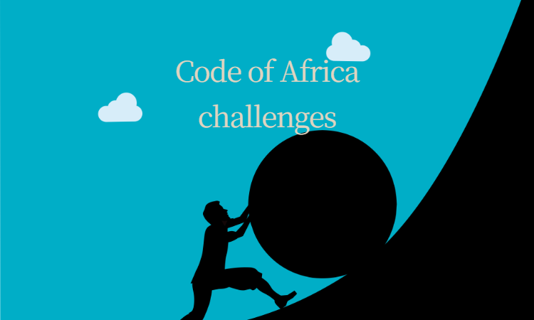

# Take-home Challenges

This repo consists of UI and coding challenges from CodeOfAfrica as part of a professional training program entry.

## Installation

Clone the repository by ` git clone https://github.com/karangwaajika/codeOfAfrica-challenges.git`

## Usage

* UI challenge: Interactive Photo Gallery
  - Use either the git host `https://karangwaajika.github.io/codeOfAfrica-challenges/` or
  - After cloning this repo, inside it, there is a file named "index.html" Click on it to view the interaction.
* Coding challenge: Array Manipulation and String Transformation
  - Inside a "challenges" folder, there are 2 files; "arrayMap.js" for task 1 and "stringTrasform.js" for task 2.
  - Make sure to install a code editor or IDE with the javaScript supporting tool to run these files.

## Contributing

Pull requests are welcome, but only after the first of July 2024.

